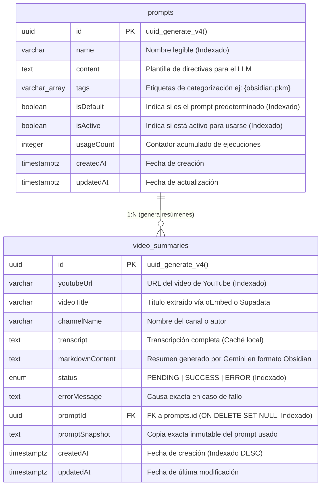

# Arquitectura del Proyecto: Automatización de Resúmenes de YouTube (v3 - Pipeline Nativo Híbrido)

**Autor:** Nahuel Mansilla  
**Fecha de Documentación:** Septiembre 2026  

---

## 1. Descripción General del Proyecto

El proyecto consiste en una plataforma web integral diseñada para automatizar la extracción, transcripción y resumen inteligente de videos de YouTube con Inteligencia Artificial. El resultado final se almacena en PostgreSQL para previsualización inmediata en el frontend (Angular) y, simultáneamente, se sincroniza como un archivo `.md` en Google Drive (para Obsidian) a través de un micro-worker opcional en n8n.

El sistema permite ingresar enlaces de YouTube, hacer un seguimiento asíncrono en tiempo real mediante WebSockets, visualizar el historial, auditar errores con trazabilidad exacta y consultar la cuota mensual de la API externa de transcripción (Supadata).

## 2. Infraestructura y Seguridad (Red)

*   **Hosting:** Servidor Virtual Privado (VPS) administrado mediante **Dokploy**. Contenedores Docker para Angular, NestJS, PostgreSQL y n8n (worker).
*   **Gestión de Dominio y DNS:** Dominio `ncodem.com` gestionado a través de **Cloudflare**.
*   **Acceso y Exposición:** **Cloudflare Tunnels** enruta el tráfico de forma segura hacia Dokploy.
*   **Capa de Seguridad Zero Trust:** **Cloudflare Access** protege el dominio (`resumenes.ncodem.com`) mediante One-Time PIN enviado al correo del administrador.

## 3. Stack Tecnológico

### Frontend: Angular
*   **Dashboard:** Input de URL, selector dinámico de prompt, botón de ejecución y panel de métricas de Supadata.
*   **Gestor de Prompts (`/prompts`):** CRUD completo para crear, editar, etiquetar, previsualizar y definir el prompt predeterminado del sistema.
*   **Tabla de Historial:** Muestra el título, canal, fecha, prompt utilizado, estado (`PENDING`, `SUCCESS`, `ERROR`) y modal/botón para "Ver Resumen" (renderizando el Markdown directamente de la BD).
*   **Notificaciones en Tiempo Real:** WebSocket/SSE recibiendo cambios de estado (`summaryCreated`, `summaryUpdated`, `summaryError`, `summaryDeleted`).

### Backend: NestJS (Cerebro y Orquestador del Pipeline)
*   **API REST & WebSockets:** Controladores para crear y consultar resúmenes (`/api/summaries`), gestionar prompts (`/api/prompts`); Gateway para emisión en tiempo real a clientes conectados.
*   **TranscriptionService:** 
    *   Extrae título y canal mediante **YouTube oEmbed** (público, rápido, 0 créditos).
    *   Extrae los subtítulos del video mediante **Supadata Transcript API**.
*   **PromptsService:**
    *   Administra las directivas del sistema para Gemini, control de unicidad de prompt predeterminado y conteo de uso (`usageCount`).
    *   Garantiza fallback automático al prompt predeterminado activo si no se indica uno específico.
*   **GeminiService:**
    *   Integración oficial con `@google/genai` (modelo `gemini-1.5-flash` / configurable vía `GEMINI_MODEL`).
    *   Aplica el prompt dinámico resuelto para generar la nota de Obsidian (frontmatter, resumen ejecutivo, conceptos clave, ideas principales y conclusiones).
*   **DriveSyncService:**
    *   Despacha en modo *Fire & Forget* hacia n8n para la subida a Google Drive.
    *   No bloquea el estado del resumen ni afecta la experiencia del usuario.

### Base de Datos: PostgreSQL
Base de datos relacional PostgreSQL administrada mediante TypeORM con migraciones versionadas automáticas.



#### Esquema de Tablas:
1. **`prompts`**:
   * `id`: UUID (Primary Key).
   * `name`: String (Título/identificador del prompt).
   * `content`: Text (Directivas e instrucciones del sistema para la IA).
   * `tags`: Array de Strings (Categorización para filtros en UI).
   * `isDefault`: Boolean (Solo un prompt activo puede ser predeterminado a la vez).
   * `isActive`: Boolean (Habilita/deshabilita el prompt para nuevas solicitudes).
   * `usageCount`: Integer (Métrica incremental de ejecuciones).
   * `createdAt` / `updatedAt`: Timestamps con zona horaria.

2. **`video_summaries`**:
   * `id`: UUID (Primary Key).
   * `youtubeUrl`: String (URL del video de YouTube).
   * `videoTitle`: String (Título extraído vía oEmbed o Supadata).
   * `channelName`: String (Nombre del canal o autor).
   * `transcript`: Text (Almacena la transcripción completa obtenida de Supadata para reutilización en reintentos y evitar consumo redundante de créditos).
   * `markdownContent`: Text (Almacena el resumen generado por Gemini).
   * `status`: Enum (`PENDING`, `SUCCESS`, `ERROR`).
   * `errorMessage`: Text (Almacena la causa exacta en caso de fallo).
   * `promptId`: UUID (Foreign Key a `prompts.id` con `ON DELETE SET NULL`).
   * `promptSnapshot`: Text (Snapshot histórico inmutable del prompt utilizado para el resumen).
   * `createdAt` / `updatedAt`: Timestamps con zona horaria.

#### Migraciones Versionadas:
* `1789051606168-InitialSchema`: Extensión UUID, Enum de estados, tabla `video_summaries` e índices.
* `1789051700000-AddTranscriptColumn`: Incorpora la columna `transcript` a `video_summaries` para la estrategia de caché y reintentos sin costo.
* `1789052000000-CreatePromptsTable`: Crea la tabla `prompts`, agrega `promptId` y `promptSnapshot` a `video_summaries` con clave foránea e índices, e inserta el seed del prompt predeterminado de Obsidian.

### Automatización Secundaria: n8n (Micro-Worker de Drive)
*   **Flujo Simplificado (2 Nodos):**
    1.  **Webhook Trigger:** Recibe `{ id, videoTitle, channelName, markdownContent, youtubeUrl }` desde NestJS con cabecera `X-Webhook-Secret`.
    2.  **Google Drive Node:** Sube o actualiza el archivo `.md` en la carpeta configurada de Obsidian.
    *   *Nota:* Ya no requiere Error Triggers complejos ni webhooks de retorno a NestJS.

## 4. Flujo de Ejecución Asíncrona y Estrategia de Reintentos

```
[ Angular ] ──(1. POST /api/summaries {url, promptId?})──> [ NestJS ] ──(2. Responde 202 Accepted)──> [ Angular ]
                                                              │
                                                              ▼ (3. Background Pipeline)
                                                  ┌───────────────────────────────────────────────┐
                                                  │ ¿Existe transcript en este registro o en BD?  │
                                                  └───────┬───────────────────────────────┬───────┘
                                                          │ NO                            │ SÍ (Reintento / Caché)
                                                          ▼                               ▼
                                           ┌──────────────────────────────┐ ┌───────────────────────────┐
                                           │ a. YouTube oEmbed (metadata) │ │ Reutiliza transcript y    │
                                           │ b. Supadata (subtítulos)     │ │ metadata existente en BD  │
                                           │ c. Guarda transcript en BD   │ │ (0 tokens gastados)       │
                                           └──────────────┬───────────────┘ └─────────────┬─────────────┘
                                                          └───────────────┬───────────────┘
                                                                          ▼
                                                          ┌───────────────────────────────┐
                                                          │ d. Resolver Prompt en BD      │
                                                          │    (por promptId o isDefault) │
                                                          │ e. Google Gemini (resumen)    │
                                                          │ f. Guarda en PostgreSQL:      │
                                                          │    markdownContent, status,   │
                                                          │    promptSnapshot inmutable   │
                                                          │ g. Incrementa usageCount      │
                                                          └───────────────┬───────────────┘
                                                                          │
                    ┌─────────────────────────────────────────────────────┴─────────────────────────────────────┐
                    ▼ (Éxito)                                                                                   ▼ (Fallo en Gemini / Supadata)
         [ Status: SUCCESS ]                                                                           [ Status: ERROR ]
         [ WebSocket: summaryUpdated ]                                                                 [ WebSocket: summaryError ]
                    │                                                                                           │
                    ▼ (Fire & Forget en background)                                                             ▼
         [ n8n: Subir a Google Drive ]                                                                 [ Usuario pulsa "Reintentar" ]
                                                                                                                │
                                                                                                                ▼
                                                                                                       (Reejecuta pipeline reutilizando
                                                                                                        el transcript persistido)
```

1.  **Recepción:** Angular envía la URL y opcionalmente el `promptId` a NestJS (`POST /api/summaries`).
2.  **Registro Inicial:** NestJS crea el registro en PostgreSQL (`PENDING`), emite el evento WebSocket `summaryCreated` y responde de inmediato al frontend.
3.  **Procesamiento en Segundo Plano con Detección de Caché:**
    *   **Paso A (Verificación de Transcripción Previa):** Antes de consultar a Supadata, NestJS verifica si el registro actual ya cuenta con `transcript` (caso de reintento tras fallo en Gemini) o si existe en la base de datos un resumen exitoso previo con la misma `youtubeUrl`.
    *   **Paso B (Consulta a Supadata solo si es necesario):** Si no existe transcripción previa, consulta YouTube oEmbed y Supadata Transcript API. **Inmediatamente después de recibir la transcripción, la persiste en la base de datos** (`videoTitle`, `channelName`, `transcript`) antes de invocar a Gemini.
    *   **Paso C (Resolución del Prompt):** Consulta en PostgreSQL el prompt solicitado por ID o el prompt predeterminado activo del sistema (`isDefault = true`).
    *   **Paso D (Generación con Gemini y Snapshot):** Se invoca a Gemini con el contenido de la transcripción y las instrucciones del prompt resuelto.
    *   **Vía Éxito:** Se actualiza el registro en `video_summaries` a `SUCCESS` con el `markdownContent`, `promptId` y `promptSnapshot` (congelando las directivas utilizadas), se incrementa `prompts.usageCount` y se notifica por WebSocket (`summaryUpdated`). Se dispara la sincronización a Google Drive vía n8n en segundo plano.
    *   **Vía Error:** Si Gemini falla (por cuota 429, timeout, saturación 503, etc.), el registro pasa a `ERROR` con el mensaje explicativo. **Dado que la transcripción ya quedó almacenada en la base de datos**, cuando el usuario hace clic en "Reintentar", el pipeline retoma directamente desde el paso de Gemini sin volver a consultar a Supadata, ahorrando créditos y acelerando el reintento.